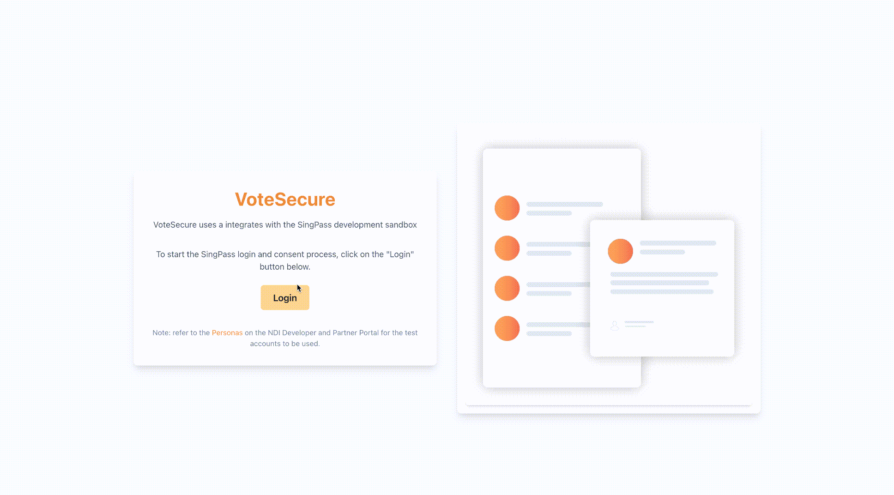

# VoteSecure

## Problem

Physical voting has both high cost and security concerns.
In contrast, voting via blockchain has the following benefits:

1. Transparency
   - Each transaction is visible in real time, allowing it to be verifiable by anyone
2. Low cost
   - Software infrastructure scales more cheaply than physical infrastructure, leading to lower costs
3. Privacy
   - Processes are verified but anonymous, maintaining privacy while ensuring security
4. Online
   - Accessible to anyone with access to the internet, making it highly convenient

## Solution

VoteSecure is a blockchain-based voting system designed to offer transparency, security, low cost, and accessibility for both administrators and users. By leveraging blockchain technology and zero-knowledge proofs (ZKPs), VoteSecure aims to provide a secure and private voting platform where users can confidently cast their votes, and administrators can efficiently manage the voting process

# Features

## Singpass Integration

